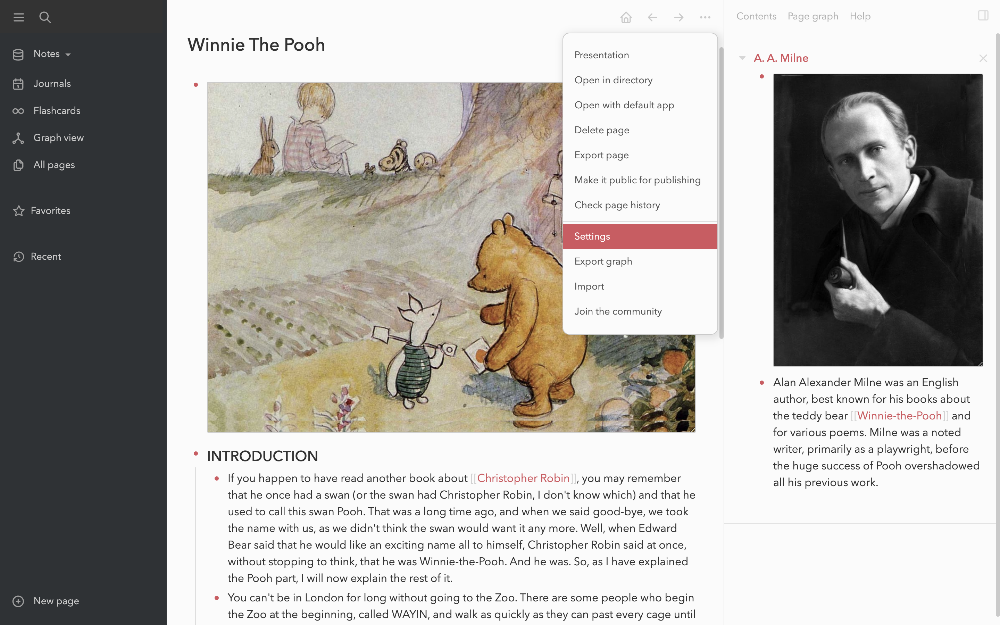
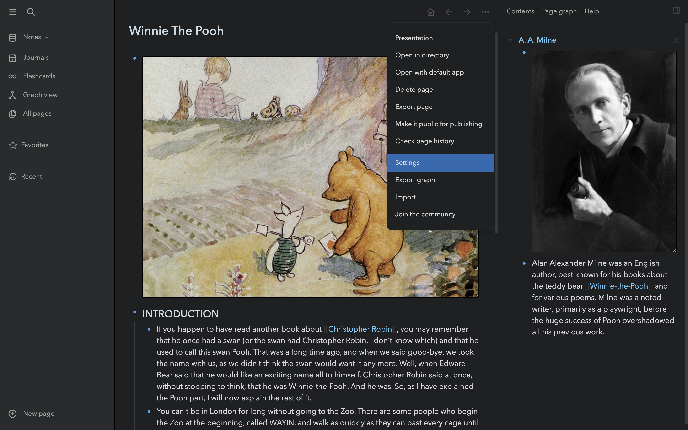

# Bear Theme for Logseq
> You're braver than you believe, stronger than you seem and smarter than you think.

A [Bear](https://bear.app) insprired theme for [Logseq](https://logseq.github.io). Supports light and dark mode.

## If you want to support my work

- [Buy Me a Coffee](https://www.buymeacoffee.com/rcvdio)
- [Become a supporter on gödel.io](https://www.goedel.io/subscribe?utm_medium=web&utm_source=subscribe-widget&utm_content=47299057)
- [Flattr](https://flattr.com/@rcvd)
- [Paypal](https://paypal.me/rcvd)

## How to use it
Add this to your 'custom.css' page in Logseq:

    @import url('https://rcvd.github.io/logseq-bear-theme/bear.css');

## Screenshots

## Bugs and feedback
- If you find a bug, file it under "Issues" with a short description and a screenshot
- If you want to discuss an issue contact me on [Twitter](https://twitter.com/rcvd_io) or drop me an email to roam (at) rcvd (dot) io
